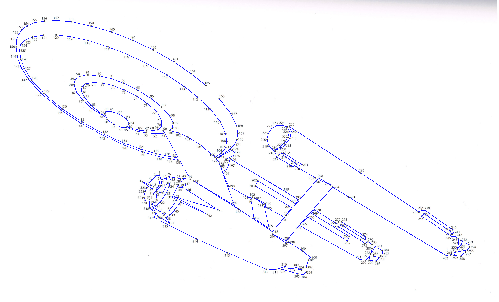
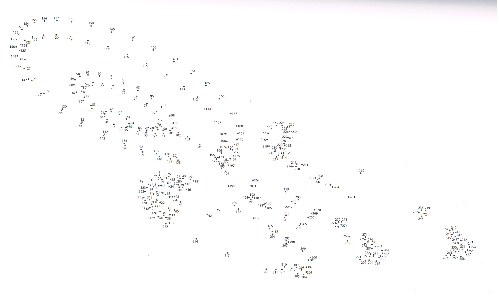

# dot-to-dot
Dot To Dot puzzle solver. Dots detection is based on OpenCV Hough Circle Transform,
digit recognition is implemented using HOG-based SVM. 

The problem of the current version is primarily incorrect detection of the dot number location 
(for example - on the sample img numbers 17 and 12 are assigned to the same dot).

 
## Usage
To use application install packages listed in requirements.txt with \
```pip install -r requirements.txt``` 

Then run \
```python run -m MODEL_PATH -i INPUT_PATH -o OUTPUT_PATH```  

+ -m: path to the model used in the digit recognition
    - default: *classify/models/svm.cpickle*
+ -i: path to the input image
    - default: *img/1.jpg*
+ -o: path to the output image
    - default: *img/*


Sample output (command: ```python run```):

Input:

